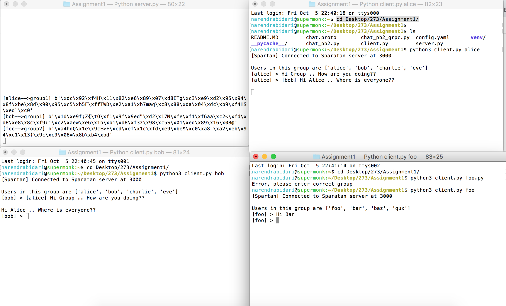
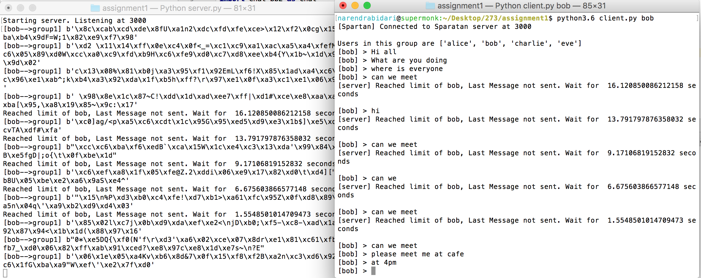
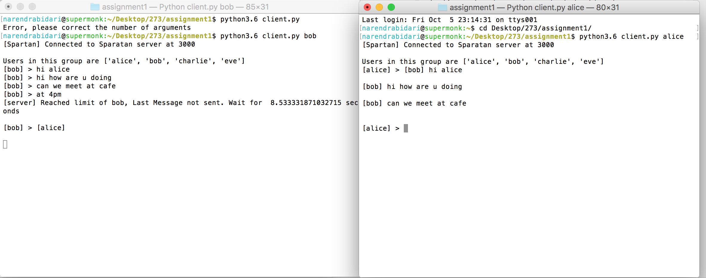

###Spartan Messenger

######Building Spartan Messenger using GRPC in Python3. You might want to use gRPC response streaming to continuously receive chat messages from the Spartan server.

1. Group Chats Implmentation  
Client side
    - Created a thread for reading the continously read the messages from the client  
    - Created a thread polling for the messages from the server  
 
    Server side  
    
    - Yielding the messages received from the client to server
    
 2. LRU Cache implementation
 
    - Created a lru cache at channel(group) level  
    - Evicted(Popped) top 3 messages if it reaches the limit
    
 3. Rate Limiting per user
 
    - Stored the 'timestamp' and the 'number of messages' in a data structure  for every message of each client 
    - For every incoming message check if number of messages is less than the max number, within difference time(current - first message time) 
    save it in the cache and send the status to the client as "good"
    - Otherwise send the message "not good" to the server to indicate rate limit reached and inform to wait  
 
 4. AES encryption 
    - Secret key is 16 bytes in bytes
    - Used the padding function to pad extras to the message to match to be the multiple of the key
    - Utilized the pycrpto for encryption and decryption  
    
 5. Decorators for cache and rate limit function
 
 
######Edge cases 

- Checked for illegal arguments
- Checked for undefined user in the groups  
- 2 different group members can't chat with each other 
- Notification to user if reached the rate limit

#####Results
  
- Below is the screenshot alice and bob speaking on group 1 and foo on group 2

- Below is the screenshot displaying rate limit  

- Below is the screenshot displaying cache saving the messages when alice goes offline and comes back online
